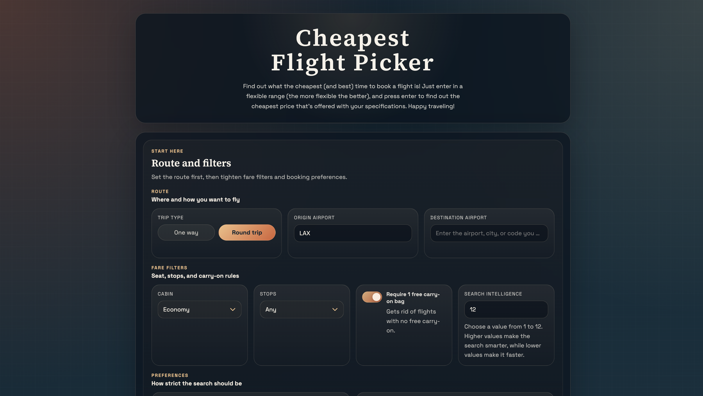

# Cheapest Flight Picker

This is a flight search app that compares every single flight within the specifications you give it, and simply feeds you the cheapest options.

It still uses Google Flights when you run it locally on your own machine, and it also gives you both a browser UI and a CLI if you'd want one.

The root of this repo is intentionally pretty clean to let even your grandma run this tool, and the meat of the project lives in `workspace/app`.



Here's what you get when you fire it up. Punch in a flexible range, hit the button, and let it do the digging.

## What this thing does

- Searches flexible departure and return windows
- Lets you filter by:
  - departure and arrival time
  - cabin
  - stops
  - airlines
  - direct-booking preference when Google exposes the seller
- Shows these result buckets:
  - Cheapest overall
  - Cheapest round-trip
  - Cheapest two one-ways
  - Cheapest nonstop
  - Cheapest option with stops
- Gives you Google Flights links for the results it finds
- Has a hidden admin panel you can open with `` ` `` or `~` for logs, auto-origin diagnostics, timing guidance, price alerts, and Hacker Fare state

## Easiest way to run it

If you only download one launcher file, it will download the rest of the repo into a `CheapestFlightPicker` folder in the same directory before launching the app. The launchers also try to install missing Git and Node.js automatically when your package manager or official installers are available.

### Windows

Run the file:

```bat
setup-and-launch.bat
```

### Linux

For a desktop launcher, open Terminal and run:

```bash
chmod +x setup-and-launch.desktop
```

Then open or trust `setup-and-launch.desktop` from your file manager.

Or run the launcher script directly from Terminal:

```bash
chmod +x setup-and-launch.sh
./setup-and-launch.sh
```

You can also use the app bundle entry point:

```bash
chmod +x setup-and-launch.app/Contents/MacOS/setup-and-launch
./setup-and-launch.app/Contents/MacOS/setup-and-launch
```

### macOS

Open the app bundle from Finder, or run this from Terminal:

```bash
chmod +x setup-and-launch.app/Contents/MacOS/setup-and-launch
open setup-and-launch.app
```

## Background

I wanted to visit my girlfriend across the country as a broke college student, and google flights wasn't cutting it for me.

After hours of researching other repos and methods people have released to find the 'cheapest' flight, I found the good resources were all paygated.

I was not happy.
Out of spite, I made this tool.

## License
This repo is source-available under `PolyForm Noncommercial 1.0.0`.

That means:

- you can read the code
- you can learn from it
- you can use it for personal, hobby, research, and other noncommercial stuff

What you cannot do under this license:

- use it commercially
- sell it
- use it in a paid product, paid service, client project, or business workflow without permission

If you want to use this commercially, you need a separate commercial license from the author (me)

Feel free to contact me here at
`https://github.com/MarsLuay` or at [marwanluay2005@gmail.com](mailto:marwanluay2005@gmail.com)

See [LICENSE](LICENSE) for the actual license text.

## Legal

- [Privacy Policy](docs/privacy-policy.md)
- [Terms of Service](docs/terms-of-service.md)
lication:** Info-level clone groups are mostly intentional parallel server/web modules or repeated UI branches; deduplicating them would be a large refactor with no user-facing benefit.
